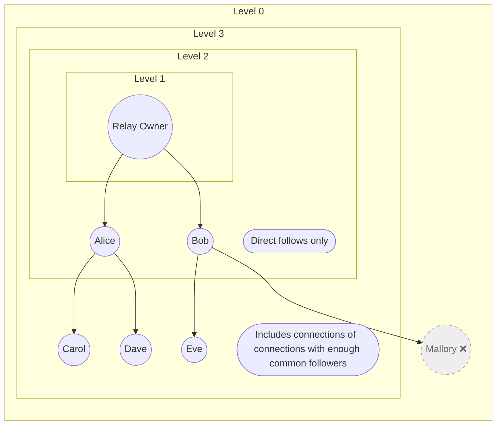

Here’s a revised version that keeps your tone but improves clarity, grammar, and flow:

---

# Web of Trust

Thanks to the Outbox model, clients will try to write all messages that tag you, comment on, or otherwise interact with your posts to your Inbox relay. Likewise, clients will try to write all messages to your Chat relays.

To protect your Inbox and Chat relays from spam and unwanted messages, Haven implements a Web of Trust (WoT) system. This allows you to control who can write to these relays based on your follow list.

## Configuration

The WoT depth can be configured using the `WOT_DEPTH` environment variable:

* **Level 0**: Disabled. Anyone on Nostr who tags you can write to your Inbox relay or send messages to your Chat relays. Not recommended.
* **Level 1**: Private. Only the relay owner can write to the Inbox and Chat relays.
* **Level 2**: Following. Only the relay owner and the people they follow directly can write to the Inbox and Chat relays.
* **Level 3**: Connections of connections. The relay owner, the people they follow, and the people followed by them can write to the Inbox and Chat relays. This is the default setting.

Level 3 offers a good balance between privacy and spam protection by allowing connections of connections to interact with 
you while filtering out most spam. However, it also requires heavier and potentially slower computation to calculate the 
WoT graph.

Level 2 provides direct control by allowing only people you follow to write to your relays. A Level 3 configuration with 
a sufficiently high `WOT_MINIMUM_FOLLOWERS` value can be a good compromise between Levels 2 and 3. Most users should 
start with Level 3 and adjust `WOT_MINIMUM_FOLLOWERS` if spam becomes an issue.

If you prefer not to store other people’s notes, Level 1 is the most private setting. Level 0 is not recommended, as it 
allows anyone to write to your relays, which can lead to spam and unwanted interactions.

### Other Settings

* `WOT_MINIMUM_FOLLOWERS`: The minimum number of common followers required for someone to be included in your Web of Trust at Level 3.
* `WOT_FETCH_TIMEOUT_SECONDS`: The maximum time, in seconds, that the relay will wait for a response when fetching Web of Trust data from other relays. Default is 30.
* `WOT_REFRESH_INTERVAL`: How often the relay should refresh its Web of Trust data. Supports duration strings such as `24h` and `1h`. Default is 24h.

