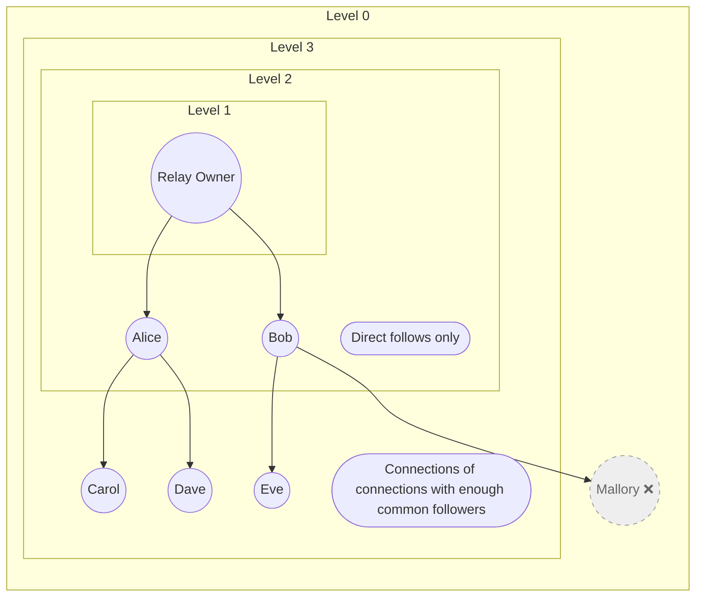

# Web of Trust

To protect your Inbox and Chat relays from spam and unwanted messages, Haven implements a Web of Trust (WoT) system.
This allows you to control who can write to these relays based on your follow list.

## Configuration

The WoT depth can be configured using the `WOT_DEPTH` environment variable:

* **Level 0**: Disabled. Anyone on Nostr who tags the relay owner can write to the Inbox relay or send messages to 
  the Chat relay.
* **Level 1**: Private. Only the relay owner can write to the Inbox and Chat relays.
* **Level 2**: Following. Only the relay owner and the people they follow directly can write to the Inbox and Chat 
  relays.
* **Level 3**: Connections of connections. The relay owner, the people they follow, and the people followed by them can 
  write to the Inbox and Chat relays. Connections of connections must have a minimum number of common followers to be 
  included in the Web of Trust. This is the default setting.

Level 0 is not recommended, as it allows anyone to write to Inbox and Chat relays, which can lead to spam and unwanted 
interactions.

If you prefer not to store other people’s notes, Level 1 is the most private setting.

Level 2 provides direct control by allowing only people directed followed by the relay owner to write to their relays, 
but will exclude everyone else.

Level 3 offers a good balance between privacy and spam protection by allowing connections of connections to interact 
with the relay owner while filtering out users without a minimum number of common followers. However, it also 
requires heavier and potentially slower computation to calculate the WoT graph.

Most users should start with Level 3 and adjust the `WOT_MINIMUM_FOLLOWERS` to make the WoT more or less restrictive 
based on their preferences and the size of their follow graph.

### Other Settings

* `WOT_MINIMUM_FOLLOWERS`: The minimum number of common followers required for someone to be included in your Web of 
  Trust at Level 3. Default is `3`.
* `WOT_FETCH_TIMEOUT_SECONDS`: The maximum time, in seconds, that the relay will wait for a response when fetching Web 
  of Trust data from other relays. Default is `30`.
* `WOT_REFRESH_INTERVAL`: How often the relay should refresh its Web of Trust data. Supports duration strings such as
  `24h` and `1h`. Default is `24h`.

